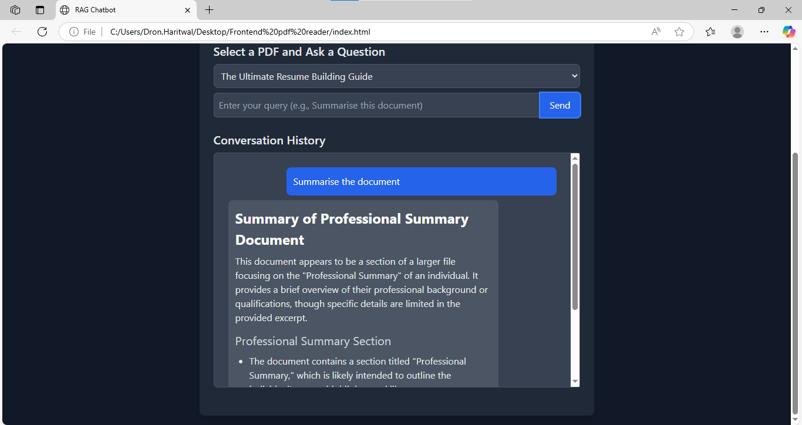

📄 Azure-Powered RAG Chatbot
A Retrieval-Augmented Generation (RAG) chatbot application powered by Azure AI, capable of answering queries based on the contents of uploaded PDF documents. It supports both command-line and REST API interfaces.

🚀 Features
🔍 Index and embed PDF documents using Azure AI Embeddings API.

🧠 Ask contextual questions using Chroma vector store and Grok-3 model.

🗂️ Persistent vector storage per PDF file.

🧵 Multi-turn conversational history.

🌐 REST API (FastAPI) with support for:

Uploading PDFs

Querying documents

Viewing conversation history

Listing indexed PDFs

🛡️ Input validation and error handling

## 🧪 Sample Screenshot

##Uploading a file

##Option to select file

##Context Understanding feature

##Response

##Work with multiple documents

🏗️ Project Structure

.
├── main.py                # CLI chatbot interface
├── rag_query.py           # Core RAG chatbot logic
├── vector_utils.py        # Document loading, splitting, and embedding
├── api_server.py          # FastAPI-based web API
├── .env                   # Environment variables (not committed)
└── README.md              # This file

🔧 Setup Instructions
1. 🧱 Prerequisites
Python 3.9+

An Azure AI account with:

EmbeddingsClient endpoint + model (e.g., text-embedding-3-small)

ChatCompletionsClient endpoint + model (e.g., xai/grok-3)

A valid Azure API key

2. 📦 Install Dependencies

pip install -r requirements.txt

Make sure your requirements.txt includes:

langchain
langchain-community
langchain-core
langchain-chroma
unstructured
chromadb
azure-ai-inference
python-dotenv
fastapi
uvicorn
pydantic

3. 🔐 Environment Variables
Create a .env file in the root directory:

ini
Copy
Edit
GITHUB_TOKEN=your_azure_api_key_here
🧪 Running the Application
📥 Upload & Chat (CLI Mode)
bash
Copy
Edit
python main.py
You'll be prompted to enter the path to a PDF file.

Once indexed, you can start chatting with the assistant.

Type exit or quit to stop.

🌐 Start API Server
bash
Copy
Edit
uvicorn api_server:app --reload
📤 Upload PDF
POST /upload-pdf

Upload a .pdf file for indexing.

🧾 Ask a Question
POST /query

json
Copy
Edit
{
  "query": "What is the main idea of the document?",
  "pdf_name": "example_pdf"
}
📚 Get History
GET /history?pdf_name=example_pdf

📂 List PDFs
GET /list-pdfs

📁 Uploads & Storage
PDFs are saved temporarily to ./uploads/.

Vector stores are saved to ./chroma_db_<pdf_name>/.

On server shutdown, all uploads and vector stores are cleaned up.

🧠 Powered By
Azure AI – Embeddings and Chat models (text-embedding-3-small, xai/grok-3)

LangChain – Document parsing and vector management

ChromaDB – Persistent vector storage

FastAPI – RESTful API server

Unstructured – Robust PDF loader

🛠️ Development Tips
Use logger.debug(...) or logger.info(...) to monitor internal behavior.

You can index multiple PDFs – each will have its own persistent vector DB.

Fine-tune chunk sizes in split_document() for optimal results.
